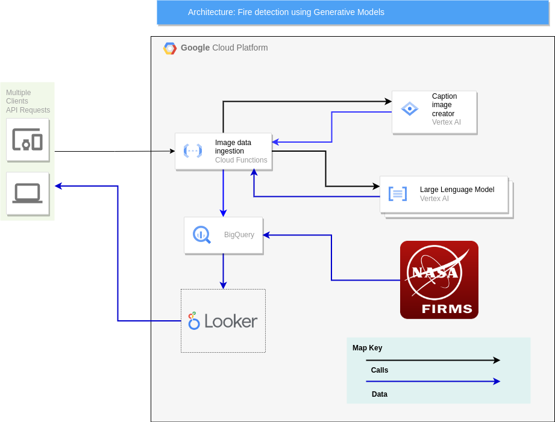

# Data Ingestion NASA Space Apps Challenge 2023
## Description
This project is a data ingestion pipeline for the NASA Space Apps Challenge 2023. It is a cloud function that receives an image and a json file with metadata and stores them in a Google Cloud Storage bucket. The function is triggered by an HTTP request. The function is written in Python 3.9 and uses the Google Cloud Storage API.


### Requirements
- Python 3.9
- Google Cloud SDK (if you want to run the function in local)
## Installation
For test in local you must have installed the Google Cloud SDK and Functions Framework for Python. You can install it with pip:
```bash
pip install functions-framework
```

To run the function in local you must execute the following command:
```bash
functions-framework --target=handle_event
```


## Usage
### Local
```bash
curl -X POST -H "Content-Type: multipart/form-data" \
  -F "imagen=@imagen.jpeg" \
  -F "data=@datos.json" \
   http://localhost:8080
```
### Cloud

```bash
curl -X POST -H "Content-Type: multipart/form-data" \
  -F "imagen=@imagen.jpeg" \
  -F "data=@datos.json" \
   https://europe-west1-round-ring-401308.cloudfunctions.net/image_processing
```

## Architecture
